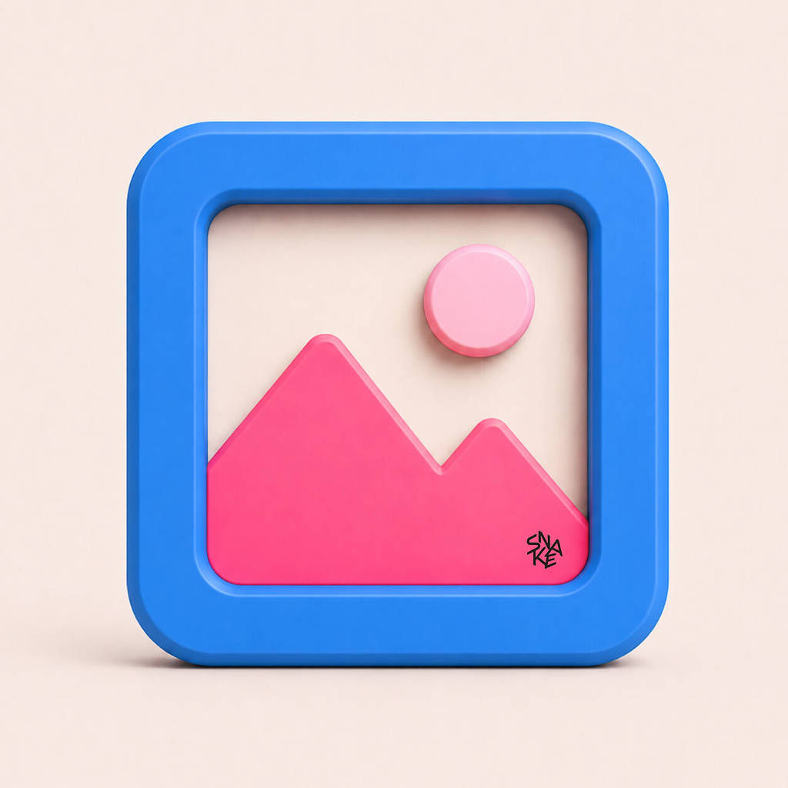

# Finance Creative Pipeline

<p align="center">
  
</p>

<p align="center">
  Daily finance creative collection, ChatGPT Web generation, transparent asset separation, and editable Figma delivery.
</p>

<p align="center">
  <a href="#中文">中文</a> · <a href="#english">English</a>
</p>

---

## 中文

### 项目简介

Finance Creative Pipeline 是一个面向中国互联网金融运营素材的 Codex 插件。它通过可恢复的本地流水线完成以下工作：

1. 使用持久化 Chrome 从花瓣详情页采集高分辨率可见参考图，并保留来源链接和尺寸信息。
2. 将每个方向的参考图只上传一次，让 ChatGPT 网页版在内部理解后直接生成一张品牌中性的完整预览图，不输出中间分析或提示词。
3. 每天创建或复用一个日期项目，每个方向只使用一个项目内聊天；该方向的生图、语义拆图和一次批量透明素材请求都在同一聊天完成。
4. 在同一聊天中直接要求 ChatGPT 基于刚生成的预览图识别复杂视觉元素并生成语义化 `layers.json`，不重复上传预览图。
5. 将所有不可原生重建的复杂视觉合并为一次正式请求，要求 ChatGPT 分别返回独立、已有透明通道且不含可编辑文字或简单结构的 PNG；本地只验证，不裁剪、不抠图、不修复 Alpha。
6. 每个方向拆图完成后立即启动 5 分钟冷却和该方向的 Figma 重建/QA；只有两者均完成后，仍在运行的同一进程才自动开始下一方向。

默认正式运行会采集 10 张参考图并生成 10 个原创方向：5 个弹窗、3 个 Banner、2 个浮窗，每个方向使用 1 张同类型参考图。

### 核心原则

- 图片生成必须使用 ChatGPT 网页版，不以 Codex 图片生成作为替代。
- 每个方向生成一张完整预览图；所有不可原生重建的复杂素材在同一条批量请求中声明，但 ChatGPT 必须把每个素材分别返回为独立透明 PNG，不生成精灵图或多元素素材板。
- 弹窗方向只生成弹窗本体与干净的外部安全留白，不生成 App 页面、搜索栏、导航栏、底部 Tab、页面卡片或虚化界面背景。
- 所有文字、数字、金额、单位和 CTA 文案必须是 Figma 原生文本；普通功能图标使用 Remix Icon；背景、卡片、红包或信封背板、按钮、矩形、边框、分隔线、简单渐变和简单阴影必须原生重建。只有人物、吉祥物、复杂 3D 主体、独特插画、复杂飘带和特殊立体徽章等真正不可重建的视觉才使用位图。
- `preview.png` 是 Figma 复原的唯一视觉真值。所有图层按归一化 bbox 精确换算坐标和尺寸；素材画布内部禁止 Auto Layout，不允许手工近似摆放、重新居中或优化间距。
- Figma 完成状态必须附带原尺寸 Editable 导出、实际几何回读、50% 叠图、差分热图和通过的 QA 报告。视觉相似度不得低于 95%，并同时满足位置、尺寸、文字基线、素材完整性和结构门槛；仅做左右截图对比不能通过。
- 普通功能图标优先从 [Remix Icon](https://remixicon.com/) 匹配官方 SVG，并以可编辑矢量导入 Figma；不再手绘临时图标或使用无语义占位形状。
- 参考图用于确定主视觉类别、材质气质、颜色关系和信息层级；可保留相近的金融主体（如红包或相近权益材质），同时重设计具体造型细节、文案和局部排布，避免完整照搬。
- 透明素材只接受 ChatGPT 在同一方向聊天中一次批量生成的独立透明 PNG。禁止从完整预览裁切元素，也禁止本地背景差分、抠图、去背景、透明边裁切或 Alpha 修复；视觉上连成一体的复杂主视觉保持为一个素材，空间上独立的复杂视觉分别返回。
- 拆图回复以最新完整且非空的 `DECOMPOSE_START` / `DECOMPOSE_END` 标记 JSON 为完成信号，不依赖单一消息选择器或停止按钮。恢复与重试前先扫描已有聊天，发现完整结果就立即保存，不重复提交。
- 采集审核只提交花瓣当日新鲜的公开图片直链，每批固定 6 个；ChatGPT 必须实际打开图片并返回 `imageAccessible: true` 才可通过。回复以当前批次 Pin ID 完全匹配的 `REFERENCE_AUDIT_START` / `REFERENCE_AUDIT_END` 标记 JSON 为完成信号。页面文字默认每秒本地检查一次，已保存对话接口最多每 15 秒读取一次，审核提示词至少间隔 30 秒；若出现“操作太频繁”，当前批次会落盘并自动冷却 10 分钟，再从同一聊天继续监听。只有输入框和提示明确证明原点击被拒绝时，冷却后才允许重试一次。审核通过后才下载原图并进行像素、哈希和重复性校验。
- 本地只验证尺寸、Alpha、前景比例、透明比例和文件重复性，不修改 ChatGPT 返回的像素。
- 空白、不透明或重复输出会被拒绝。ChatGPT 返回少于请求数量时，保留全部有效素材并将报告记为 `partial`，不逐元素追问或修复；缺少关键素材导致明显空洞时，最终 Figma QA 仍会失败。
- 每个运行日期只使用一个名为 `金融运营素材 YYYY-MM-DD` 的 ChatGPT 项目。候选内容审核聊天 `采集筛选-弹窗/Banner/浮窗` 和正式方向聊天都保存在该日期项目内；每个设计方向仍只使用一个聊天完成直接生图和拆图。
- 项目内聊天会显式命名为 `弹窗1` 至 `弹窗5`、`Banner1` 至 `Banner3`、`浮窗1` 至 `浮窗2`；编号在各素材类型内独立计算，验证运行中的每个类型从 1 开始。
- 参考图使用 ChatGPT 图片专用上传控件；只有该方向 1 张附件的文件名、缩略图和发送状态全部验证通过后，才在同一条消息中要求 ChatGPT 内部理解参考图并直接生图。正常成功路径只上传 1 次，不请求中间分析、设计规格或可见提示词；普通生图重试复用聊天中的参考图，只有 ChatGPT 明确表示未收到图片时才重新上传。
- 流水线从 `run.json` 和 `figma-manifest.json` 恢复，避免重复采集、重复生成和重复创建 Figma 日期分区。
- `figma-manifest.json` 只由生成器写入；Figma 节点和逐方向 QA 状态独立保存在 `figma-sync-state.json`，以产物指纹防止重生成后误用旧同步结果。
- 每次运行固定使用花瓣作为参考图来源。
- 参考图按类型采集：弹窗、Banner、浮窗分别使用匹配的关键词池和数量配额，不混用搜索词。浮窗优先搜索 `3D金融图标`，随后扩展到金融 3D 图标、理财图标、金币/红包/优惠券图标、金融小图标、活动浮窗和金融插图，通用 `3D图标` 仅作最后兜底。ChatGPT Web 根据图片实际内容做最终判断；图标小图可以没有文案或按钮，但必须从画面中看出货币、金币、银行卡、红包、收益、行情等明确金融语义。
- 每个缺失方向最多扫描 30 个未见 Pin，每个关键词最多取 3 个候选，最多临时下载 8 张；候选按每批 6 张放入当天项目中的类型筛选聊天。图片可访问、类型匹配、设计完整且含广义运营信号时直接进入 `references/`；分数、结构和可用性只用于审计和排序，不再拥有否决权。数字、金额、`元`、`¥/$/%`、金币、优惠券、仪表盘、数据图表、趋势或上升箭头、红包、利息或息费均算合格信号，出行、电商、会员等其他行业不会因此被拒绝。
- 弹窗和 Banner 保留默认 720px 最低宽度，Banner 继续要求宽高比至少 1.5；浮窗不使用宽度、高宽比或 Alpha 门槛，只要是主体完整、可独立使用的图标小图、3D 图标、插画单元素或元素加按钮即可进入看图审核。模糊标题、文件名和 `IMG_*` 不再直接淘汰。
- `reference-history.json` 长期记录已采集的花瓣 Pin，并通过 SHA-256、花瓣素材键和联合感知指纹排除同一图片；单独的 aHash 碰撞不会再淘汰不同设计，重复判定会记录匹配 Pin 和依据。
- Figma 左侧始终是完整预览，右侧必须是可见的可编辑重建，禁止左右两边显示同一张扁平图。

### 环境要求

- Node.js 20 或更高版本
- Google Chrome
- 可用的 ChatGPT 网页版会话
- 可用的花瓣会话
- Codex 桌面版及已启用的官方 Figma connector
- 对目标 Figma 文件的编辑权限

### 快速开始

```bash
git clone https://github.com/snakekwokkk/finance-creative-pipeline.git
cd finance-creative-pipeline
npm install
```

创建用户配置目录并复制示例配置：

```bash
mkdir -p "$HOME/Library/Application Support/Codex/finance-creative-pipeline"
cp assets/config.example.json \
  "$HOME/Library/Application Support/Codex/finance-creative-pipeline/config.json"
```

编辑配置文件，至少填写目标 Figma 文件的 `fileKey` 和 `pageId`：

```text
~/Library/Application Support/Codex/finance-creative-pipeline/config.json
```

首次使用或登录失效时运行：

```bash
npm run setup
```

登录设置、测试、正式、定时和断点恢复运行均使用带持久化配置的可见专用 Chrome。花瓣会对无头浏览器返回 `405`，而 macOS 后台启动方式不能稳定复用 ChatGPT 登录会话，因此默认不再隐藏或最小化窗口。遇到验证码、安全验证或权限确认时会停止并通知用户，流水线不会绕过安全限制。

每次工作流最多启动一次专用 Chrome，并在启动阶段一次性准备选定来源的搜索页、Pin 详情页和 ChatGPT 标签页。所有方向和重试均复用该浏览器会话。

先运行小规模测试：

```bash
npm run test-run
```

只验证 1 张弹窗参考图采集，成功后立即停止，不进入生图、拆图或 Figma：

```bash
npm run test-popup-collection
```

正式运行：

```bash
npm run run
```

### Codex 插件安装

此仓库是插件源码。将它加入已配置的本地 Codex marketplace 后，可使用 marketplace 名称安装：

```bash
codex plugin add finance-creative-pipeline@<marketplace-name>
```

本地开发更新后，应更新 `.codex-plugin/plugin.json` 的 cachebuster 并重新安装插件。新技能内容会在新 Codex 任务中加载。

### 配置说明

用户配置保存在插件仓库之外，不应提交到 Git：

| 配置项 | 说明 |
| --- | --- |
| `timezone` | 日期目录和漏跑检查使用的时区 |
| `chromeExecutable` | Chrome 可执行文件路径 |
| `profileDirectory` | 持久化登录配置目录 |
| `outputRoot` | 每日运行产物根目录 |
| `browser.mode` | 浏览器模式，默认 `visible`；`background` 和 `headless` 仅保留用于诊断 |
| `figma.fileKey` | 目标 Figma 文件 key |
| `figma.pageId` | 目标 Figma 页面 ID |
| `collection.source` | 采集来源固定为 `huaban` |
| `collection.referenceCount` | 正式运行采集的参考图数量 |
| `collection.minReferenceWidthPx` | 弹窗和 Banner 详情图的最低像素宽度，默认 720；浮窗不使用此门槛 |
| `collection.maxScannedCandidatesPerDirection` | 每个缺失方向最多浏览的 Pin 数，默认 30 |
| `collection.maxCandidatesPerKeyword` | 每次搜索词轮换最多取得的候选数，默认 3 |
| `collection.maxDownloadedCandidatesPerDirection` | 每个缺失方向最多临时下载并验证的图片数，默认 8 |
| `collection.visualReviewBatchSize` | 单次 ChatGPT 直链内容审核候选数，固定为 6 |
| `collection.visualReviewMaxBatchesPerType` | 每种素材类型最多审核批次数，固定为 3，即最多审核 18 张 |
| `collection.visualReviewTimeoutMinutes` | 每批直链审核等待上限，默认 4 分钟 |
| `collection.visualReviewMaxAttempts` | 每批候选内容审核总尝试次数，默认 2 |
| `collection.visualReviewDomPollIntervalSeconds` | 审核等待期间本地页面文字检查间隔，默认 1 秒 |
| `collection.visualReviewSavedConversationPollIntervalSeconds` | ChatGPT 已保存对话接口读取间隔，默认 15 秒 |
| `collection.visualReviewSubmissionIntervalSeconds` | 审核聊天提示词的最小提交间隔，默认 30 秒 |
| `collection.visualReviewRateLimitCooldownMinutes` | 参考图审核检测到“操作太频繁”后的自动冷却时间，默认 10 分钟；冷却后刷新原聊天，提示仍在则继续下一轮冷却 |
| `generation.rateLimitCooldownMinutes` | 生图、语义分层和透明素材检测到“操作太频繁”后的自动冷却时间，默认 10 分钟；保留提交锁并循环等待、刷新原聊天，不重复提交 |
| `collection.maxSearchScrolls` | 为寻找未采集 Pin 执行的最大滚动次数 |
| `collection.searchPlans` | 弹窗、Banner、浮窗各自的配额和搜索词列表 |
| `generation.directionCount` | 原创方向数量 |
| `generation.directionCooldownMinutes` | 每个方向拆图完成后至下一方向的最短间隔，默认 5 分钟；与当前方向 Figma 组合质检同时进行 |
| `generation.postCollectionCooldownMinutes` | 全部参考图采集和审图完成后，提交第一条生图请求前的静默间隔，默认 5 分钟；恢复时沿用原截止时间 |
| `generation.figmaCompletionPollIntervalSeconds` | 等待当前方向 Figma 质检结果时读取本地状态的间隔，默认 2 秒 |
| `generation.maxAttempts` | 预览生成总尝试次数，默认 2 |
| `generation.imageTimeoutMinutes` | 单次生图等待上限，默认 5 分钟 |
| `generation.decompositionTimeoutMinutes` | 语义分层单次等待上限，默认 5 分钟 |
| `generation.decompositionMaxAttempts` | 语义分层总尝试次数，默认 2 |
| `chatgpt.dailyProjects` | 是否每天创建或复用一个 ChatGPT 日期项目，默认开启 |
| `chatgpt.projectNamePrefix` | 日期项目前缀，默认 `金融运营素材` |
| `transparentAssets.maxAssets` | 单方向最多拆出的复杂视觉素材数，默认 8 |
| `transparentAssets.timeoutMinutes` | 单次批量透明素材请求的等待上限，默认 5 分钟 |
| `transparentAssets.minForegroundRatio` | 单素材最小前景占比 |
| `transparentAssets.minTransparentRatio` | 单素材最小透明像素占比 |

完整示例见 [`assets/config.example.json`](assets/config.example.json)。

### 运行状态与恢复

每日运行目录默认位于：

```text
~/Desktop/互联网金融素材/YYYY-MM-DD/
```

主要状态：

| 状态 | 含义 |
| --- | --- |
| `running` | 本地采集、生成、分解或方向闭环正在进行；拆图完成后同步启动5分钟计时和当前方向的 Figma 工作 |
| `collection_complete` | 仅采集测试已成功完成；生图、拆图和 Figma 均未开始 |
| `collection_incomplete` | 仅采集测试未找到足量合格参考图；后续阶段未开始 |
| `awaiting_figma` | ChatGPT 阶段结束，至少一个完整方向可以开始 Figma 同步；失败方向保留审计记录 |
| `complete` | Figma 同步和视觉核验完成 |
| `blocked` | 需要用户处理登录、验证码、权限或其他外部阻塞 |

失败方向的冷却期间仍属于 `running`：`run.json.activeDirection.stage` 为 `failed_cooldown`，并包含失败阶段、原因、剩余毫秒和冷却截止时间。运行器会输出 `direction_failed`、`direction_failure_cooldown`、`direction_failure_cooldown_complete` 三类事件；监控该进程的 Codex 必须在失败发生和冷却结束时立即向用户发送可见进度消息。

恢复任务时先读取已有 `run.json`、`figma-manifest.json` 和 `figma-sync-state.json`。方向始终按编号严格顺序处理，历史失败不会被移动到新方向之后。运行器每拆完一个方向就输出 `direction_ready`，并从拆图完成时刻启动 5 分钟计时；Codex 立即组合并质检当前方向。只有当前方向通过 Figma QA 且 5 分钟已经到期，仍在运行的同一进程才开始下一方向。预览、语义分层和批量透明素材监测在主等待窗口结束后都会执行最终边界回扫，先接收临界时刻返回的有效结果，再判断是否失败。等待期间复用并保持同一个 Chrome，不执行下一方向的 ChatGPT 操作。若运行进程或浏览器已经退出，它不会在 5 分钟后自行重启；人工续跑会沿用已记录的截止时间，而不是重新计时。如果本地阶段已经完成，只排空尚未通过 QA 的 Figma 方向，不要重新运行采集和生成。

参考采集先执行内容审核：每个新审核批次固定 6 张，每种素材类型最多 3 批、即 18 张；三批后未凑满目标数量时保留已通过的参考图并转入下一类型采集。进入生产后，方向始终按编号严格顺序执行。预览生成和语义分层各自保留独立尝试预算；透明素材每个方向只允许一次正式批量提交，不进行逐元素重试或修复对话。当前方向任一阶段失败时，结果会立即写入 `figma-manifest.json.failures`、更新 `run.json`、输出结构化事件并发送系统通知；随后同一进程与 Chrome 静默等待满 5 分钟，冷却结束后再次上报，才允许尝试下一编号方向。若冷却中途退出，恢复时沿用原截止时间，不重新计时或重试该失败方向。登录失效、验证码、安全验证、权限问题或对话访问限流属于全局阻塞，会立即停止而不是继续后续方向。

### 输出结构

```text
YYYY-MM-DD/
├── run.json
├── figma-manifest.json
├── figma-sync-state.json
├── reference-rejections.json
├── reference-audit-chats.json
├── reference-audits/
├── references/
└── directions/
    └── 01/
        ├── preview.png
        ├── spec.json（仅旧版运行可能存在）
        ├── layers.json
        └── layers/
            ├── decomposition-report.json
            └── NN-layer-id.png
```

输出根目录还会维护 `reference-history.json` 和 `reference-rejections.json`：前者长期保存已接受的 Pin ID、SHA-256、aHash、256 位 dHash、来源、尺寸和采集日期；后者保存因标题、视觉结构或已确认重复而拒绝的 Pin 及具体原因。重复图片必须由精确哈希、相同花瓣素材键或联合感知指纹确认，不能仅凭 aHash 和宽高比淘汰。每日运行会跳过两类历史记录并继续向下检索。恢复旧运行时，若某个 `ready` 方向引用的素材在重新审计后进入当天拒绝台账，只让该方向失效并使用新合格参考重新生成；其他完整方向继续复用。

- `preview.png`：完整、扁平化的最终预览。
- `spec.json`：仅用于兼容旧版运行；新方向不再生成中间设计规格。
- `layers.json`：ChatGPT 输出的语义图层计划。
- `decomposition-report.json`：批量透明素材的接收状态、Alpha 质量、警告和限制。
- `layers/*.png`：ChatGPT 分别生成、已有透明通道且通过本地验证的独立素材。
- `figma-sync-state.json`：独立的逐方向 Figma 队列状态、产物指纹、Section/Frame 节点 ID、上传数和视觉 QA 结果。

### Figma 交付规范

每个方向使用左右并排结构：

- `Preview`：左侧完整预览图。
- `Editable`：右侧可见的可编辑重建。
- `Visual Base`：锁定但隐藏，只作为核对参考，不能作为右侧可见交付。
- `Editable Elements`：通过检查的 ChatGPT 批量透明素材，以及原生文字、Remix Icon 矢量、卡片、按钮、背板和简单几何图层。

弹窗右侧画布保持透明，只重构弹窗卡片、阴影、贴附主视觉和卡内元素，不还原弹窗后方的页面界面。Banner 和浮窗从 `layers.json` 的背景图层读取原生背景；旧版方向可使用 `spec.json.palette` 作为补充回退。Figma 完成前必须逐方向截图，并检查：

- 左右两侧不是同一张扁平图。
- 没有重复 OCR、文字溢出或错误换行。
- 没有矩形闪光、假箭头、空框等畸形占位矢量。
- 主视觉没有被卡片遮罩洗白。
- 可编辑区域不是空白，且关键文字和独立素材可见。

详细流程见 [`skills/finance-creative-pipeline/references/figma-sync.md`](skills/finance-creative-pipeline/references/figma-sync.md)。

方向级同步使用独立状态命令，避免与仍在运行的生成器争写 manifest：

```bash
npm run figma-sync-progress -- inspect --date YYYY-MM-DD
npm run figma-sync-progress -- section --date YYYY-MM-DD --section-id NODE_ID
npm run figma-sync-progress -- start --date YYYY-MM-DD --direction 1
npm run figma-sync-progress -- node --date YYYY-MM-DD --direction 1 --node-id NODE_ID
npm run figma-sync-progress -- complete --date YYYY-MM-DD --direction 1 --uploaded-assets 3 --qa-report /absolute/path/to/figma-qa-report.json
npm run mark-figma-complete -- --date YYYY-MM-DD
```

### 常用命令

```bash
npm run setup          # 打开首次登录流程
npm run test-run       # 1 张参考图、1 个方向的测试运行
npm run test-three-types # 弹窗、Banner、浮窗各 1 个的隔离验证运行
npm run test-transparent-assets -- --image /path/to/preview.png # 只测试透明素材拆分
npm run find-remix-icon -- --query "shield check" --style line # 检索 Remix Icon SVG
npm run figma-sync-progress -- inspect --date YYYY-MM-DD # 检查方向级 Figma 队列
npm run run            # 10 张参考图、10 个方向的正式运行
npm run run -- --visible # 显式强制可见模式，可覆盖诊断用 browser.mode 配置
npm run check-missed   # 检查漏跑
npm run check          # 运行语法检查和自动化测试
```

### 安全与合规

- 不导出、共享或提交 Chrome 持久化登录目录。
- 不自动处理验证码、WAF、安全验证、付费限制或下载限制。
- 只从 Pin 详情页公开可见图片元素下载预览图，并保留列表缩略图、最终图片和 Pin 来源 URL。
- 不生成真实品牌 Logo、真实公司名称、固定收益、保证审批、监管背书或其他误导性金融承诺。
- 不将不透明、空白、跨格或质量检查失败的结果伪装成透明独立素材。
- 不提交用户配置、登录数据或每日运行产物。

普通功能图标使用 Remix Icon 4.9.1，遵循该版本随包提供的开源许可证。Remix Icon 只用于功能性或信息性图标，不用于 Logo、商标或品牌标识。

---

## English

### Overview

Finance Creative Pipeline is a Codex plugin for daily Chinese internet-finance operations creatives. It runs a resumable local workflow that:

1. Collects higher-resolution visible references from Huaban through a persistent Chrome profile, preserving source URLs and dimensions.
2. Uploads each direction reference once and asks ChatGPT Web to understand it internally and directly generate one brand-neutral, complete preview without exposing an intermediate analysis or prompt.
3. Creates or reuses one dated project per day and keeps preview generation, decomposition, and transparent-asset extraction for each direction in one project chat.
4. Uses the just-generated preview in the same chat, without re-uploading it on the normal path, to identify complex visual elements and produce a semantic `layers.json` plan.
5. Sends one batch request in the same direction chat for all non-reconstructable complex visuals and saves each independent transparent PNG that ChatGPT returns.
6. Syncs previews, accepted transparent assets, and native text/geometry into Figma.

A normal run collects 10 references and generates 10 original directions: five popups, three banners, and two floating creatives, with one type-matched reference per direction.

### Design Principles

- Image generation must use ChatGPT Web. Codex image generation is not a fallback.
- Generate exactly one complete preview. Ask for all complex assets in one prompt, but require each asset as an independent transparent image rather than a sprite sheet or contact sheet.
- Popup directions generate only the popup body with a clean outer safety margin. They must not generate an App page, search bar, navigation, bottom tabs, page cards, or a blurred interface background.
- Keep all text editable, use Remix Icon for ordinary functional icons, and redraw backgrounds, cards, envelope or red-envelope backplates, buttons, rectangles, borders, dividers, simple gradients, and simple shadows natively in Figma. Only genuinely complex people, mascots, 3D subjects, illustrations, ribbons, and special dimensional decorations become raster assets.
- Treat `preview.png` as the sole visual truth for Figma reconstruction. Convert every normalized bbox to exact canvas coordinates and dimensions; prohibit Auto Layout inside artwork canvases and never approximate, re-center, or optimize the composition.
- Require a native-resolution Editable export, actual Figma geometry readback, 50% overlay, difference heatmap, and passing QA report before completion. Similarity must be at least 95% while position, size, text baseline, asset completeness, and structural checks also pass; side-by-side screenshots alone are not sufficient.
- Match ordinary functional icons against official [Remix Icon](https://remixicon.com/) SVGs first and import them as editable Figma vectors instead of hand-drawing temporary icons or using generic placeholders.
- References provide the visual category, material feel, color relationship, and information hierarchy. Generated work may retain a similar financial subject while redesigning concrete shape details, copy, and local layout instead of copying the full design.
- Never crop elements from the preview and never run local matting. ChatGPT is asked once to return separate transparent PNGs for every declared complex visual; already-transparent outputs are validated and copied without pixel modification.
- Semantic decomposition completes as soon as the newest non-empty `DECOMPOSE_START` / `DECOMPOSE_END` JSON block is available. It does not depend on one assistant-message selector or the stop control disappearing, and resume/retry paths consume an existing complete response before submitting again.
- Reference content review submits only fresh public Huaban image URLs, exactly six per new batch. ChatGPT must actually open each URL and return `imageAccessible: true`; only accepted links are downloaded for pixel, hash, and duplicate checks. Completion uses the newest `REFERENCE_AUDIT_START` / `REFERENCE_AUDIT_END` JSON block whose Pin IDs exactly match the current batch, checking the rendered page once per second and the saved conversation no more than once every 15 seconds.
- Local processing only validates Alpha, dimensions, foreground ratio, and duplicate bytes; it does not crop, trim, infer Alpha, or remove backgrounds.
- Empty or opaque assets remain rejected. If ChatGPT returns fewer images than requested, every valid returned image is retained and a partial direction may continue into Figma without per-element retry.
- Each run date uses one ChatGPT project named `金融运营素材 YYYY-MM-DD`. The `采集筛选-弹窗/Banner/浮窗` content-audit chats and every direction-generation chat stay inside that dated project. Each design direction still uses exactly one chat for direct generation and decomposition.
- Project chats are explicitly renamed with type-local numbering: `弹窗1`–`弹窗5`, `Banner1`–`Banner3`, and `浮窗1`–`浮窗2`. Isolated validation runs start each included type at 1 instead of using the global direction index.
- Reference images use ChatGPT's image-specific upload input. After the expected filename, rendered thumbnail, and send-ready state are verified, the same message asks ChatGPT to understand the reference internally and directly generate the preview. The normal successful path uploads once and produces no intermediate analysis, design spec, or visible image prompt. Ordinary generation retries reuse the reference already present in the chat; re-upload occurs only when ChatGPT explicitly reports the reference missing.
- Resume from `run.json` and `figma-manifest.json` to avoid duplicate collection, generation, or dated Figma sections.
- Use Huaban as the sole reference provider for every run.
- Collect popup, Banner, and floating references from separate type-matched keyword pools. Float discovery starts with `3D金融图标`, broadens through finance 3D/small icons, coin/red-envelope/coupon icons, floating entries, and finance illustrations, and keeps generic `3D图标` only as the final fallback. ChatGPT Web makes the final decision from actual image content. A complete icon-sized image may omit copy or buttons, but it must visibly express finance through currency, coins, bank cards, red envelopes, returns, market data, or similar signals.
- For each missing direction, scan up to 30 unseen Pins, rotate after at most three candidates per query, and resolve fresh public main-image URLs from the locally authenticated Huaban detail page. Review exactly six URLs per new batch in the dated project's type-specific audit chat. Accept every accessible, type-matched, complete design with any broad operational signal; score, structure, and usability remain audit metadata and cannot veto acceptance. Arabic numerals, explicit amounts, `元`, `¥/$/%`, coins, coupons, dashboards, data charts, trend or upward arrows, red envelopes, and interest or fee wording all qualify. Travel, ecommerce, membership, dining, utility, and other-industry references remain valid when those conditions pass.
- Popup and Banner references retain the 720 px minimum-width gate, and Banners retain an aspect ratio of at least 1.5. Floating references have no width, aspect-ratio, or Alpha gate at collection time; opaque standalone subjects proceed to later ChatGPT transparent extraction. Ambiguous titles, filenames, and `IMG_*` labels proceed to image-content review instead of being rejected.
- Keep Huaban Pin IDs and strong image fingerprints in `reference-history.json` to avoid collecting the same image again. Exact hashes, stable Huaban asset keys, or combined aHash and 256-bit dHash fingerprints may reject a duplicate; aHash plus aspect ratio alone may not.
- The Figma preview stays on the left. The right side must visibly render editable layers and must never duplicate the same flattened image.

### Requirements

- Node.js 20 or later
- Google Chrome
- An active ChatGPT Web session
- An active Huaban session
- Codex desktop with the official Figma connector enabled
- Edit access to the target Figma file

### Quick Start

```bash
git clone https://github.com/snakekwokkk/finance-creative-pipeline.git
cd finance-creative-pipeline
npm install
```

Create the user configuration outside the repository:

```bash
mkdir -p "$HOME/Library/Application Support/Codex/finance-creative-pipeline"
cp assets/config.example.json \
  "$HOME/Library/Application Support/Codex/finance-creative-pipeline/config.json"
```

Edit the configuration and provide at least `figma.fileKey` and `figma.pageId`:

```text
~/Library/Application Support/Codex/finance-creative-pipeline/config.json
```

For first use or expired sessions:

```bash
npm run setup
```

Login setup, tests, normal runs, scheduled runs, and resumed runs all use a visible dedicated Chrome with the persistent profile. Huaban returns HTTP 405 to headless Chrome, while the macOS background-launch mode does not reliably preserve the ChatGPT authenticated session, so the window is no longer hidden or minimized by default. CAPTCHA, security checks, and permission prompts stop the run and require user action; they are never bypassed.

Each workflow starts the dedicated Chrome at most once and prepares the selected source search, Pin-detail, and ChatGPT tabs together. Every direction and retry reuses that browser session.

Run the small test first:

```bash
npm run test-run
```

Run the normal workflow:

```bash
npm run run
```

### Codex Plugin Installation

This repository contains the plugin source. After adding it to a configured local Codex marketplace, install it by marketplace name:

```bash
codex plugin add finance-creative-pipeline@<marketplace-name>
```

For local development updates, refresh the cachebuster in `.codex-plugin/plugin.json` and reinstall the plugin. New skill content is loaded in a new Codex task.

### Configuration

User configuration lives outside the repository and should never be committed:

| Key | Description |
| --- | --- |
| `timezone` | Timezone used for dated runs and missed-run checks |
| `chromeExecutable` | Chrome executable path |
| `profileDirectory` | Persistent login profile directory |
| `outputRoot` | Root directory for daily artifacts |
| `browser.mode` | Browser mode; defaults to `visible`, while `background` and `headless` remain diagnostic-only alternatives |
| `figma.fileKey` | Target Figma file key |
| `figma.pageId` | Target Figma page ID |
| `collection.source` | Collection provider, fixed as `huaban` |
| `collection.referenceCount` | Number of references in a normal run |
| `collection.minReferenceWidthPx` | Minimum detail-image width for popup and Banner references; defaults to 720 and does not apply to floats |
| `collection.maxScannedCandidatesPerDirection` | Maximum Pins browsed per missing direction; defaults to 30 |
| `collection.maxCandidatesPerKeyword` | Maximum candidates taken before rotating a query; defaults to 3 |
| `collection.maxDownloadedCandidatesPerDirection` | Maximum temporary downloads per missing direction; defaults to 8 |
| `collection.visualReviewBatchSize` | Public image URLs in one ChatGPT content-audit batch; fixed at 6 |
| `collection.visualReviewMaxBatchesPerType` | Maximum audit batches per creative type; fixed at 3, or 18 candidates |
| `collection.visualReviewTimeoutMinutes` | Wait limit per URL content-audit batch; defaults to 4 minutes |
| `collection.visualReviewMaxAttempts` | Content-audit attempts per batch; defaults to 2 |
| `collection.visualReviewDomPollIntervalSeconds` | Local rendered-text polling interval while waiting; defaults to 1 second |
| `collection.visualReviewSavedConversationPollIntervalSeconds` | Saved-conversation API polling interval; defaults to 15 seconds |
| `collection.visualReviewSubmissionIntervalSeconds` | Minimum spacing between audit-chat prompt submissions; defaults to 30 seconds |
| `collection.visualReviewRateLimitCooldownMinutes` | Automatic cooldown for reference-audit frequency limits; defaults to 10 minutes and repeats after refreshing the same chat while the notice remains |
| `generation.rateLimitCooldownMinutes` | Automatic cooldown for generation, decomposition, and transparent-asset frequency limits; defaults to 10 minutes and preserves the submit-once lock while refreshing the same chat |
| `collection.maxSearchScrolls` | Maximum scroll attempts used to find unseen Pins |
| `collection.searchPlans` | Type-specific quotas and queries for popup, Banner, and floating references |
| `generation.directionCount` | Number of original directions |
| `generation.directionCooldownMinutes` | Minimum interval after one direction finishes decomposition; defaults to 5 minutes and overlaps its Figma reconstruction and QA |
| `generation.postCollectionCooldownMinutes` | Idle interval after all collection and review complete and before the first generation request; defaults to 5 minutes and resumes from the persisted deadline |
| `generation.figmaCompletionPollIntervalSeconds` | Local-state polling interval while waiting for the current direction's Figma QA; defaults to 2 seconds |
| `generation.maxAttempts` | Total preview-generation attempts; defaults to 2 |
| `generation.imageTimeoutMinutes` | Maximum wait per image-generation attempt; defaults to 5 minutes |
| `generation.decompositionTimeoutMinutes` | Maximum wait per semantic-decomposition attempt; defaults to 5 minutes |
| `generation.decompositionMaxAttempts` | Total semantic-decomposition attempts; defaults to 2 |
| `chatgpt.dailyProjects` | Create or reuse one dated ChatGPT project per day; enabled by default |
| `chatgpt.projectNamePrefix` | Prefix for dated project names; defaults to `金融运营素材` |
| `transparentAssets.maxAssets` | Maximum non-reconstructable complex assets per direction; defaults to 8 |
| `transparentAssets.timeoutMinutes` | Maximum wait for the one batch transparent-asset request; defaults to 5 minutes |
| `transparentAssets.minForegroundRatio` | Minimum foreground ratio per asset |
| `transparentAssets.minTransparentRatio` | Minimum transparent-pixel ratio per asset |

See [`assets/config.example.json`](assets/config.example.json) for the complete example.

### Run States and Recovery

Daily artifacts are stored by default under:

```text
~/Desktop/互联网金融素材/YYYY-MM-DD/
```

The output root also contains `reference-history.json`, a persistent ledger of accepted Pin IDs, SHA-256 hashes, aHashes, 256-bit dHashes, sources, dimensions, and collection dates. Each run reads it before scrolling for unseen results, and every duplicate decision is written to the rejection ledger with the matched Pin and reason.

Primary states:

| State | Meaning |
| --- | --- |
| `running` | Local work or one direction's closure gate is active; decomposition starts the five-minute timer and current-direction Figma work together |
| `awaiting_figma` | The ChatGPT phase is over and at least one complete direction can be synced; failures remain auditable |
| `complete` | Figma sync and visual verification are complete |
| `blocked` | Login, CAPTCHA, permissions, or another external issue requires user action |

A failed direction remains in `running` state during its cooldown. `run.json.activeDirection.stage` is `failed_cooldown` and includes the failed stage, reason, remaining milliseconds, and deadline. The runtime emits `direction_failed`, `direction_failure_cooldown`, and `direction_failure_cooldown_complete`; the Codex task monitoring the process must immediately surface the first and last events to the user.

Always inspect `run.json`, `figma-manifest.json`, and `figma-sync-state.json` before resuming. Directions always run in strict numeric order; historical failures are never moved behind new directions. Each decomposed direction emits `direction_ready` and starts its five-minute timer. Reconstruct and verify that direction in Figma during the timer; the still-running process keeps the same Chrome session idle and starts the next direction only after both Figma QA and the timer are complete. Preview, decomposition, and batch-asset monitoring perform a final boundary scan before declaring a timeout, so a valid result arriving at the edge is consumed first. If the process or browser exits, it does not relaunch itself after five minutes. A manual resume reuses the persisted deadline instead of restarting the timer. If local generation is already complete, drain only the remaining Figma queue.

Reference collection submits fresh public image URLs in new batches of exactly six, with at most three batches or 18 candidates per creative type. After the third batch, it keeps whatever approved references were found and continues to the next collection type instead of filling the nominal quota indefinitely. Production directions then run in strict numeric order. Preview generation and semantic decomposition retain their independent attempt budgets; transparent assets use one formal batch submission per direction with no per-element repair turns. If any stage of the current direction fails, the runtime immediately persists and reports the result through `figma-manifest.json`, `run.json`, a structured event, and a system notification. The same process and Chrome then remain idle for a full five-minute failure cooldown; completion is reported again before the next numeric direction may start. A resumed process reuses the persisted deadline instead of restarting the cooldown or retrying that failed direction. Login expiry, CAPTCHA, security checks, permission issues, and conversation rate limits remain global blockers and stop immediately.

### Output Layout

```text
YYYY-MM-DD/
├── run.json
├── figma-manifest.json
├── figma-sync-state.json
├── reference-rejections.json
├── reference-audit-chats.json
├── reference-audits/
├── references/
└── directions/
    └── 01/
        ├── preview.png
        ├── spec.json (legacy runs only)
        ├── layers.json
        └── layers/
            ├── decomposition-report.json
            └── NN-layer-id.png
```

- `preview.png`: complete flattened preview.
- `spec.json`: legacy-run compatibility only; new directions do not create an intermediate design spec.
- `layers.json`: semantic layer plan produced by ChatGPT Web.
- `decomposition-report.json`: per-asset Alpha and boundary metrics, warnings, and limitations.
- `layers/*.png`: independently generated transparent assets accepted by the quality gate.
- `figma-sync-state.json`: isolated per-direction Figma queue state, artifact fingerprints, node IDs, upload counts, and visual-QA results.

The output root also keeps `reference-history.json` for accepted references and `reference-rejections.json` for content-rejected Pins and their audit reasons. Both ledgers are used to avoid repeating unsuitable results. On resume, a ready direction whose source was newly rejected by the daily re-audit is selectively regenerated with its replacement reference; unrelated complete directions remain reusable.

### Figma Delivery Contract

Each direction uses a side-by-side layout:

- `Preview`: complete flattened preview on the left.
- `Editable`: visible editable reconstruction on the right.
- `Visual Base`: locked and hidden reference only; it must not be used as the visible right-side delivery.
- `Editable Elements`: accepted ChatGPT batch-generated transparent assets plus native editable text, Remix Icon vectors, cards, buttons, backplates, and simple geometry.

Popup editable canvases stay transparent and reconstruct only the popup card, shadow, attached hero, and internal elements; the page behind the popup is never rebuilt. Banner and float directions derive native backgrounds from the background layer in `layers.json`; legacy directions may use `spec.json.palette` only as a fallback. Before completion, screenshot every direction and verify:

- The left and right sides are not the same flattened image.
- OCR is not duplicated, clipped, or wrapped incorrectly.
- No malformed placeholder geometry appears as empty boxes, rectangular sparkles, or fake arrows.
- Hero artwork is not washed out by card masks.
- The editable area is nonblank and shows key text and independent assets.

See [`skills/finance-creative-pipeline/references/figma-sync.md`](skills/finance-creative-pipeline/references/figma-sync.md) for the full workflow.

The producer exclusively owns `figma-manifest.json`. Incremental Figma work uses `figma-sync-state.json`, so manifest updates cannot overwrite node or QA progress. Artifact fingerprints reset a regenerated direction to pending while retaining its Frame ID for idempotent replacement.

### Commands

```bash
npm run setup          # Open first-login setup
npm run test-run       # Test with 1 reference and 1 direction
npm run test-three-types # Isolated validation with one popup, Banner, and float
npm run test-transparent-assets -- --image /path/to/preview.png # Test transparent separation only
npm run find-remix-icon -- --query "shield check" --style line # Search Remix Icon SVGs
npm run figma-sync-progress -- inspect --date YYYY-MM-DD # Inspect the per-direction Figma queue
npm run run            # Normal 10-reference, 10-direction run
npm run run -- --visible # Explicitly force visible mode, overriding diagnostic browser.mode settings
npm run check-missed   # Check for a missed scheduled run
npm run check          # Run syntax checks and automated tests
```

### Security and Compliance

- Never export, share, or commit the persistent Chrome profile.
- Never bypass CAPTCHA, WAF, security interstitials, paywalls, or download restrictions.
- Download only previews exposed by visible image elements on Huaban Pin detail pages, preserving the list thumbnail, selected image, and Pin source URLs.
- Do not generate real logos, real company names, fixed returns, guaranteed approvals, fabricated regulatory endorsements, or other misleading financial claims.
- Never present empty, opaque, or rejected images as valid transparent assets. Never crop or locally matte the preview to fabricate an asset.
- Never commit user configuration, authentication data, or daily run artifacts.

Ordinary functional icons use Remix Icon 4.9.1 under the open-source license included with that package. Remix Icon is used only for functional or informational symbols, never as a logo, trademark, or brand identity.
